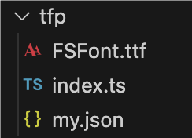
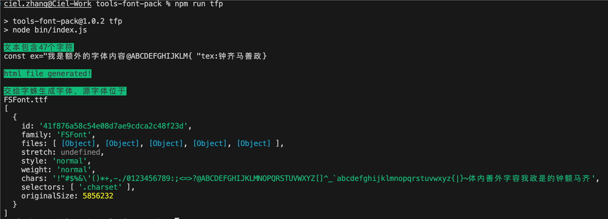
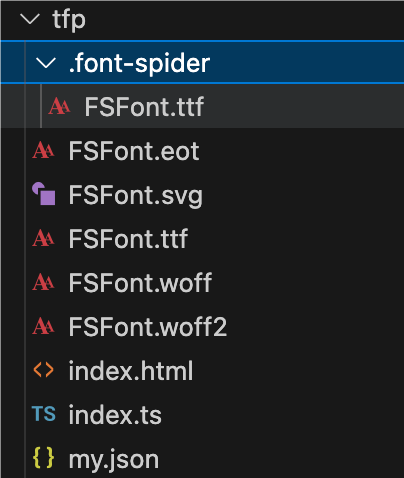

# font-slim

该工具是一个用于优化字体文件的 npm 库。它可以分析项目文件中使用的文本，并根据这些文本以及指定的字体文件，创建一个仅包含必要字形的压缩后的字体文件。

## 指令说明

字体文件压缩工具提供了多个配置选项，以适应不同的使用场景。以下是所有可用的命令行参数及其描述：

- `-f, --fontName [font name]`: 设置生成的字体名称。默认值为 `"FSFont"`。
- `-s, --src [source]`: 设置要分析的源码文件夹路径。默认值为 `"./tfp"`。
- `-t, --filetypes [file types]`: 设置接受的文件类型后缀，使用 `|` 分隔。默认值为 `"js|ts|json"`。
- `--fontPath [font path]`: 设置用于生成的压缩字体文件的，基于 source 文件夹的字体路径。默认值为 `"./"`。
- `-n, --no-ascii`: 设置是否不包含 ASCII 字符集。默认情况下，ASCII 字符集会被包含。

以下是使用这些参数运行工具的示例：

```bash
tfp -f "CustomFont" -s "./assets/code" --fontPath "./assets/fonts" -t "js|ts" --no-ascii
```

## 使用方法

在文件夹中（默认名称为 ftp）放入：

- 需要解析的全量字体文件（默认名称为 FSFont），常见格式均支持
- 任意命名的多个文本文件，支持 js、ts、json

示例：


执行（本地安装时）

```bash
npx tfp
```


执行指令后，压缩字体的全格式可在当前目录找到，源文件则可在.font-spider/目录下找到。

